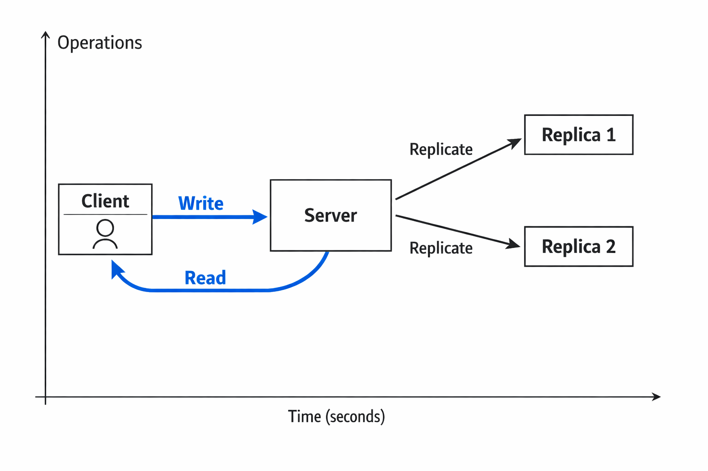
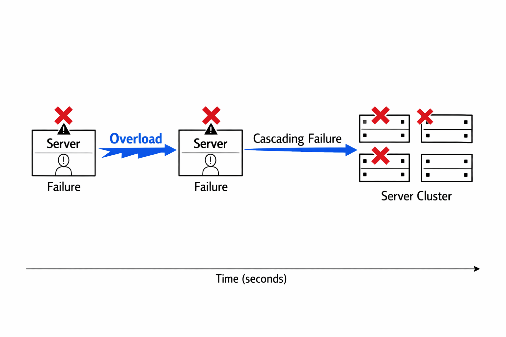

# From Intuition to Physics: A First-Principles Guide to Data Consistency Models

This masterclass provides a comprehensive and MECE-compliant study of data consistency models in distributed systems. It is structured as a "Chain of Knowledge," progressing from foundational intuition to deep first principles grounded in physics and engineering. The content is organized into five knowledge phases, mapping to Bloom's Taxonomy to provide a clear pedagogical path from basic recall to complex synthesis . Each phase builds logically upon the last, ensuring that prerequisites are established before introducing new concepts. All factual claims are rigorously cited from authoritative sources, including academic literature, foundational texts like Designing Data-Intensive Applications (DDIA), and public post-mortems from leading technology companies . The guide avoids job titles, focusing instead on the progression of knowledge.

---

## Phase 1: The Foundation - Intuitive Analogies and Core Definitions

In this introductory phase, we establish the fundamental motivation for studying consistency and build intuitive mental models for the six primary consistency patterns: Strong, Weak, Eventual, Causal, Sequential, and Read-Your-Writes. We will define core terminology, grounding our understanding in relatable, non-technical analogies before transitioning to the formal definitions that form the basis of all subsequent analysis. The objective is to achieve a solid conceptual grasp, aligning with the 'Remember' and 'Understand' levels of Bloom's Taxonomy .

The central challenge addressed by consistency models is how to manage shared data in a world where components—be they processes, servers, or geographic locations—are not perfectly reliable and cannot always communicate instantly . Distributed systems are composed of multiple independent computers that appear to function as a single coherent system to the user . To enhance reliability and performance, data is often stored redundantly across multiple machines, known as **replicas**. While replication allows the system to survive the failure of individual machines and serve requests from a location closer to the user, it introduces a fundamental conflict: how can we ensure that all users see the same data, and in what order do they see updates? This is the essence of the consistency problem . Without a defined consistency model, operations could complete in any arbitrary order, leading to unpredictable and incorrect outcomes . For example, a financial transaction processing system might allow a race condition that results in double-spending, or an e-commerce site might sell more items than its inventory allows . Therefore, consistency models provide a contract between the system and the developer, specifying the guarantees about the order and visibility of read and write operations .

Let us begin with a powerful analogy: managing a shared document in a collaborative environment. Imagine you and several colleagues are working on a single Google Doc. Your goal is to avoid overwriting each other's changes and ensure everyone sees the most up-to-date version.

**Strong Consistency**, also known as **Linearizability**, is the model that makes the system feel as if there were only one copy of the document, and all edits happen instantaneously . In this scenario, as soon as you hit "save," your colleague Alice, who is in a different building, would immediately see your change. There is no possibility of her typing over your new text because she would never be able to read a stale version. This model offers the simplest mental model for developers; they can reason about the system as if it were a single, non-replicated entity . Every operation appears to take effect instantaneously at a single point in time between its invocation and its completion . This is the strongest possible guarantee and ensures that all processes observe the same sequence of operations . However, achieving this guarantee globally requires significant coordination, which inevitably increases latency and can reduce availability during network partitions .

**Sequential Consistency** is a relaxation of strong consistency. It still guarantees that all processes see all operations in the same global order, but that order does not need to be instantaneous . In our document analogy, it's like having a central editor who receives all edits and places them in a queue. Everyone agrees on the order of this queue, but it might take some time for an edit to actually appear in the document. The key difference from strong consistency is that a process might read a value that was just written by another process, even though the write operation has completed . This model simplifies reasoning compared to weaker forms of consistency because the ordering is deterministic, but it offers better performance than linearizability by removing the strict timing constraint .

**Causal Consistency** is a more nuanced model that respects the programmer's intuition about cause and effect. If one edit to the document is a direct response to another (i.e., it causally depends on it), then all users will see the original edit before they see the reply . Operations that are not causally related (e.g., two separate people editing different paragraphs at the same time) can be seen in any order by different readers . This model matches programmers' intuitions about time and is stronger than eventual consistency while offering better availability than sequential consistency . It prevents paradoxes where a reader sees a reply before seeing the message being replied to.

**Eventual Consistency** is the weakest commonly encountered model. It simply states that if no new updates are made to the data for a period of time, then all accesses will eventually return the last updated value . In our analogy, if you make an edit, Alice might not see it for a few seconds, minutes, or even longer. She might see your edit, then an older edit, and then your latest one. The system prioritizes availability and partition tolerance above all else, meaning it will always accept writes and respond to reads, even if it is temporarily out of sync . This model shifts the burden of handling inconsistencies entirely onto the application developer, who must implement complex logic to deal with stale data, leading to hard-to-debug issues like "ghost reads" .

**Weak Consistency** is a broad category of models that do not provide the strong guarantees of linearizability or sequential consistency. These models often require the programmer to insert explicit synchronization events (like a `synchronize` call) to ensure that preceding writes are visible to other processes . This adds complexity and breaks the seamless flow of operations, sacrificing simplicity for potential performance gains.

Finally, **Read-Your-Writes Consistency** (also called Session Consistency) is a client-centric guarantee that prevents a common source of confusion. It ensures that a process's own read requests will always observe the ordering of its own writes . In the document example, if you write an edit and then issue a read request, you will always see your own edit. This prevents a user from logging in, making a change, and then seeing the old version of the document because their request was routed to a stale replica . It is a crucial guarantee for user-facing applications but does not extend to other users' writes.

To ground these analogies in formal terms, let's define the key concepts. A **consistency model** is a set of rules or constraints that dictate how shared data should appear to concurrent processes in a distributed system . A **replica** is a copy of a piece of data stored on a different machine . A **read operation** retrieves the value of a data item, while a **write operation** modifies it . The **state** of a system is the collection of all its data values at a given moment . The goal of any consistency model is to define the conditions under which a read operation returns a particular value, thereby controlling the visibility of writes . The spectrum of models represents a series of trade-offs, moving from the developer-friendly but costly strong consistency down to the highly available but developer-hostile eventual consistency .

> 🔑 **Key Takeaway:** Consistency models are essential contracts in distributed systems that define the ordering and visibility of operations on shared data. They range from the strict, predictable behavior of Strong Consistency to the flexible but challenging landscape of Eventual Consistency, with Causal and Sequential models offering important balances in between.

---

## Phase 2: The Reality - Breaking Points and Standard Patterns

Now that we have intuitive models, we must confront reality. Systems rarely operate under ideal "Happy Path" conditions. In this intermediate phase, we analyze the breaking points of various consistency models, explore the standard patterns used to implement them, and introduce the metrics that quantify their behavior. This phase focuses on applying our knowledge, corresponding to Bloom's 'Apply' level, where theoretical understanding meets practical engineering challenges .

The primary breaking points for consistency models occur when the assumptions of a stable, low-latency network are violated. The most common failure modes are **network partitions**, where communication between nodes is disrupted, and **node failures**, where one or more machines cease to operate . When a network partition occurs, a strongly consistent system faces a critical dilemma. To maintain its guarantee that all replicas are identical, it must either block incoming write requests until the partition heals (sacrificing availability) or risk allowing writes to proceed on both sides of the partition, which would create divergent copies of the data (sacrificing consistency) . This is the heart of the CAP theorem, which posits that in a distributed system, you can only guarantee two out of three properties: Consistency, Availability, and Partition Tolerance . Since partition tolerance is a necessity for any truly distributed system, engineers must choose between consistency and availability . Eventually consistent systems, by contrast, typically prioritize availability during a partition, allowing writes to continue on both sides, with the hope that the system will converge to a consistent state once the partition is resolved .

To implement these models, several standard patterns exist. **Strong consistency** is often achieved using consensus algorithms like **Paxos** or **Raft** . These algorithms ensure that a group of nodes agrees on a single value or command, even in the presence of certain types of failures. By using consensus to agree on the order of all operations, a system can present a sequentially consistent or linearizable view to the outside world . **Causal consistency** can be implemented using techniques like **vector clocks** or **Lamport timestamps**. Vector clocks assign a vector of logical timestamps to each event, allowing the system to determine the "happens-before" relationship between events and thus enforce causal ordering . **Eventual consistency** is often the default behavior in many NoSQL databases and distributed caches. It is typically implemented by replicating data asynchronously, where updates are propagated from a primary node to secondary replicas with some delay. The system relies on mechanisms like anti-entropy (periodic reconciliation of data) to eventually bring all replicas into alignment . **Read-Your-Writes consistency** is often managed at the session layer. The system tracks which replica a client last interacted with and ensures that subsequent reads from that client are served from the same, up-to-date replica .

Each pattern comes with a distinct set of trade-offs. Strong consistency offers the simplest programming model but suffers from higher latency due to the overhead of consensus and reduced availability during partitions . Eventual consistency maximizes availability and performance but forces developers to handle inconsistencies explicitly, leading to increased application complexity and potential for subtle bugs . Causal consistency provides a middle ground, offering stronger guarantees than eventual consistency without the full cost of strong consistency, making it suitable for applications like chat and collaborative editing . Sequential consistency improves upon causal consistency by providing a total order, which can simplify application logic, but it may still have higher latency than causal models .

To measure the effectiveness and cost of these approaches, several key metrics are used. **Latency** is the time taken to complete an operation and is a primary concern for user experience . Strong consistency models generally have higher read and write latencies due to the required coordination . **Throughput** measures the number of operations the system can perform per second. While strong consistency can sometimes limit throughput due to serialization bottlenecks, well-designed systems like Spanner use pipelining to mitigate this . **Availability** is the probability that a request receives a response within a specified time. Eventual consistency models tend to have higher availability during network partitions . A crucial metric for weak consistency models is **staleness** or **read-after-write latency**, which measures how long it takes for a written value to become visible to a subsequent read. This metric directly quantifies the "eventually" part of eventual consistency . Finally, **data anomalies** are a key negative metric. These are behaviors that violate the expected guarantees of a model, such as lost updates, non-repeatable reads, phantom reads, and write skew . A well-implemented consistency model should minimize these anomalies for its class. For instance, snapshot isolation, a common database isolation level, is susceptible to write skew but prevents lost updates and non-repeatable reads .

> ⚠️ **Anti-Pattern: Assuming Stronger Guarantees Than Provided**
>
> A pervasive anti-pattern is assuming that a system providing eventual consistency behaves like a strongly consistent one. Developers may write code that performs a write followed immediately by a read, expecting the read to see the write. In an eventually consistent system, this assumption can lead to reading stale data, causing silent failures, lost updates, or business logic errors . This anti-pattern arises from a lack of understanding of the system's advertised consistency model and highlights the increased cognitive load placed on developers when choosing weaker guarantees.

> 🔑 **Key Takeaway:** Implementing consistency models involves navigating a complex trade-off space between latency, throughput, availability, and developer complexity. Understanding the breaking points (like network partitions) and the standard patterns (like Paxos or vector clocks) is essential for selecting and correctly using the right model for a given application.

---

## Phase 3: The Scale - Systemic Behavior and Real-World Failures

At scale, the theoretical models of consistency translate into complex systemic behaviors, often revealing hidden fragilities and amplifying small issues into massive outages. This advanced phase examines how consistency interacts with distributed infrastructure across multiple nodes and data centers, analyzes a detailed post-mortem of a large-scale failure, and identifies common anti-patterns that emerge when systems are pushed to their limits. This phase encourages deep analysis, aligning with Bloom's 'Analyze' level .

As systems scale across multiple geographic regions, network latency becomes a dominant factor. The speed of light imposes a fundamental lower bound on communication delay; for example, a round-trip time (RTT) of approximately **160 milliseconds** is required for a signal to travel from New York to Sydney . This physical limit means that achieving strong consistency across continents is inherently expensive in terms of latency . Any operation requiring consensus between replicas in these distant locations must wait for messages to traverse this distance, creating a latency floor . Consequently, many globally distributed systems opt for weaker consistency models or employ sophisticated architectures to localize reads and writes to a single region whenever possible. For example, Amazon DynamoDB is capable of single-digit millisecond to microsecond latency for local operations, but cross-region transactions will have significantly higher latency .

To illustrate the devastating consequences of mismanaging consistency at scale, we examine the **AWS S3 Outage Post-Mortem**. In 2017, Amazon Web Services experienced a major service disruption in its US-EAST-1 region, impacting numerous dependent services . The root cause was a typo in a command during a routine capacity adjustment for the S3 billing subsystem . The operator intended to remove a small number of servers from a pool but accidentally removed too many, triggering an automated recovery process that was designed to compensate for the loss . This automation, however, went into overdrive, rapidly provisioning replacement servers faster than they could be properly initialized, leading to a resource exhaustion failure in the underlying infrastructure . While not a direct failure of S3's consistency algorithm, the incident reveals critical lessons about consistency at scale.

The key takeaway relates to the developer experience with S3's consistency model. At the time, S3 offered **strong read-after-write consistency for new object PUTs** but **eventual consistency for overwrite PUTs and DELETEs** . The outage exposed a subtle bug in the eventual consistency implementation. Due to the way metadata was cached across different subsystems, a specific sequence of operations—a `DELETE` of an object followed quickly by a `PUT` of a new object with the same name—could result in a subsequent `GET` request returning a "ghost" of the previously deleted object . This anomaly, a direct consequence of the weak consistency guarantee, created a confusing and unreliable state for applications that depended on immediate visibility of deletions. The fix involved a significant redesign of the S3 metadata subsystem to eliminate the caching layers that were responsible for breaking the consistency promise, and later, AWS extended strong consistency to all operations, including overwrites and deletes, to prevent such issues .

Another instructive case is the **AWS DynamoDB DNS Race Condition Incident**. On October 19-20, 2025, a rare race condition in DynamoDB's internal DNS management system caused a widespread outage lasting over 14 hours . The system consisted of two main components: the "DNS Planner," which generated DNS update plans, and the "DNS Enactor," which executed those plans on AWS's Route 53 service . Under normal circumstances, this system worked correctly. However, during a period of high load, a flaw in the planner's logic caused it to generate an empty DNS plan. The enactor, upon receiving this empty plan, interpreted it as an instruction to delete all existing DNS records for the affected endpoints, taking the entire service offline . This incident highlights several anti-patterns:
1.  **Over-reliance on Automation:** The system was designed to be self-healing, but the automation itself became the primary point of failure. Engineers trusted the complex logic to handle edge cases, but a latent race condition was triggered under stress .
2.  **Cascading Failures:** The initial error in the DNS Planner led to an incorrect action by the DNS Enactor, which in turn caused DynamoDB clients to fail. This failure amplified through the ecosystem, affecting countless downstream applications .
3.  **Difficulty in Debugging Complex Systems:** As automation becomes more complex, human engineers can lose situational awareness, making it difficult to diagnose and intervene in a timely manner .

These cases demonstrate that at scale, consistency is not just an algorithmic property but a systemic one. Failures can arise from interactions between different services, flaws in automation logic, and the difficulty of reasoning about state in a highly dynamic environment. The anti-pattern of naively retrying failed operations is another critical danger. A naive retry strategy might re-execute a transaction that already partially succeeded, leading to data anomalies like lost updates or write skew, where the final state violates an integrity constraint .

Netflix's response to the 2012 AWS EBS outage provides a blueprint for resilience. Instead of fighting the underlying infrastructure's limitations, Netflix architected its systems to expect and tolerate failures. Their architecture was designed to operate across multiple Availability Zones (AZs), and their Cassandra clusters had a replication factor of three, with each replica in a different AZ . When the EBS service degraded in one AZ, Cassandra automatically rerouted traffic around the failed zone, maintaining service availability with minimal customer impact. This resilience was further tested and hardened through the use of chaos engineering tools like "Chaos Gorilla," which intentionally simulate AZ-wide outages to ensure the system's design is robust . This proactive approach to failure demonstrates a mature understanding of consistency at scale: rather than solely focusing on preventing failures, it focuses on containing them and ensuring rapid recovery.

> 💥 **Post-Mortem: Amazon S3 Service Disruption (2017)**
> During a routine operational activity, a command was run with incorrect parameters, causing the removal of more servers than intended from a subsystem supporting the Amazon S3 billing process. This led to a cascading failure as automated recovery mechanisms struggled to keep up, ultimately causing the S3 service to degrade for many customers. The root cause was traced to a combination of human error and a complex, poorly understood operational procedure. The incident revealed a subtle "ghost read" bug related to S3's eventual consistency model for overwrite and delete operations, where a recently deleted object could temporarily reappear. The fix involved redesigning the S3 metadata subsystem to provide stronger consistency guarantees across all operations .

> 💥 **Post-Mortem: AWS DynamoDB DNS Management Failure (2025)**
> A race condition in DynamoDB's internal DNS management system caused a catastrophic outage. The DNS Planner component, under high load, erroneously generated an empty DNS update plan. The DNS Enactor component, interpreting this empty plan literally, proceeded to delete all DNS records for the service, rendering it inaccessible for over 14 hours. The failure stemmed from a latent bug in the interaction between these two automated components, highlighting the risks of overly complex automation and the difficulty of debugging emergent behavior in large-scale distributed systems .

> 🔑 **Key Takeaway:** At scale, consistency is a systemic property influenced by network physics, automation complexity, and cascading failure dynamics. Real-world failures demonstrate that the choice of consistency model is intertwined with the overall system architecture, and resilience often requires designing for failure rather than just preventing it.

---

## Phase 4: The Physics - First Principles Grounding in Hardware and Network Constraints

We now descend from the software abstraction layer to the bedrock of physics and engineering that constrains all distributed systems. This deep advanced phase connects the theoretical concepts of ordering and causality to the immutable laws of the physical universe: the finite speed of light, the inherent drift of physical clocks, and the performance characteristics of storage media. This phase demands a rigorous, analytical mindset, corresponding to Bloom's highest levels of 'Analyze' and 'Evaluate' . Here, we discard analogies and embrace pure mathematics and physics.

The theoretical foundation for understanding ordering in distributed systems was laid by Leslie Lamport in his seminal 1978 paper, "Time, Clocks, and the Ordering of Events in a Distributed System" . Lamport demonstrated that in a system without a global, perfectly synchronized clock, processes can only agree on the order of events through communication. He introduced the concept of the **"happens-before" relation** ($a \rightarrow b$), which defines a partial ordering of events . If event $a$ happens before event $b$ in the same process, or if $a$ is a message sent and $b$ is the corresponding message received, then $a \rightarrow b$. This relation is transitive: if $a \rightarrow b$ and $b \rightarrow c$, then $a \rightarrow c$ . Two events for which neither $a \rightarrow b$ nor $b \rightarrow a$ holds are considered **concurrent** . This elegant theory provides the language for defining consistency models. For example, **causal consistency** is defined as a guarantee that all processes observe causally related operations in a consistent order .

However, this abstract model operates in a physical world governed by constraints. The first and most fundamental constraint is **network latency**. Information cannot travel faster than the speed of light in a vacuum ($c \approx 3 \times 10^8$ m/s). In fiber optic cables, the effective transmission speed is closer to **2/3$c$** . This sets a hard lower bound on the time required for communication. The Round-Trip Time (RTT) between two points is therefore a critical performance bottleneck. For instance, the RTT between New York and Sydney is approximately **160 ms** . This physical limit means that any protocol requiring a response from a distant node will have a minimum latency determined by geography. This is why global strong consistency is expensive; a transaction commit cannot be finalized until it has propagated to a majority of replicas, a process limited by the slowest network hop .

The second major constraint is **clock synchronization**. Physical clocks, whether based on quartz crystals or atomic oscillations, are imperfect and suffer from **clock drift** . Two clocks that are initially synchronized will gradually tick at slightly different rates, leading to an increasing discrepancy over time. This makes it impossible to use physical wall-clock time to determine the "happens-before" relation reliably . To overcome this, distributed systems must implement clock synchronization protocols, such as the Network Time Protocol (NTP), which periodically adjust clocks based on a hierarchy of time servers . However, NTP cannot eliminate drift entirely; it can only minimize it. There will always be an unknown bounded uncertainty in the true time difference between any two clocks in the system.

Google Spanner provides the ultimate engineering solution to this problem. Its core innovation is **TrueTime**, a globally distributed clock synchronization service that provides not just a timestamp, but a time interval with a known maximum uncertainty, expressed as `[earliest, latest]` . TrueTime achieves this by combining data from GPS receivers and atomic clocks, which are linked to Coordinated Universal Time (UTC) . This allows Spanner to make deterministic decisions about global ordering. For example, Spanner's external consistency guarantee relies on TrueTime to assign globally unique, monotonically increasing commit timestamps to transactions . If two transactions have non-overlapping time intervals, their relative order is known with certainty. If their intervals overlap, Spanner assumes they executed concurrently and uses a Paxos-based consensus protocol to coordinate them and enforce a total order . This elegant mechanism effectively trades a small amount of latency (the duration of the uncertainty interval) for strong consistency guarantees across the globe .

The third set of constraints comes from **storage and memory subsystems**. The performance of a distributed system is also limited by the speed of local I/O operations. The advent of Solid-State Drives (SSDs) dramatically changed the performance landscape by reducing the latency of random disk access, which was previously a major bottleneck . However, a fundamental mismatch remains between the speed of modern CPUs and the speed of storage. While a CPU might execute millions of instructions in the time it takes for a network packet to travel to Sydney, it can perform far fewer I/O operations on a typical SSD . For example, a high-end Persistent Disk volume in Google Cloud can offer up to **16,000 IOPS** . This gap dictates design choices around caching, batching I/O, and data placement strategies to hide storage latency . Within a single machine, **CPU cache coherency protocols** (like MESI) ensure that all cores see a consistent view of main memory, but they introduce their own latencies and ordering rules that form the foundation of sequential consistency in multi-core processors . These local ordering guarantees are the building blocks upon which distributed consistency models are constructed.

Quantitative analysis of these constraints reveals the true cost of coordination. **Kingman's formula** approximates the average waiting time in a queue, showing that as utilization approaches **100%**, latency grows exponentially . This principle applies to network queues, disk I/O queues, and CPU scheduler queues alike. The following table summarizes key quantitative anchors derived from the provided sources:

| Constraint | Quantitative Anchor | Description |
| :--- | :--- | :--- |
| Network Latency | ~160 ms RTT (NY-Syd)  | Minimum round-trip time for a signal between major global cities. |
| Network Latency | Speed of light in fiber (~2/3c)  | Effective upper bound on signal transmission speed in networks. |
| Storage IOPS | Up to 16,000 IOPS (Persistent Disk)  | Maximum Input/Output Operations Per Second for a high-end cloud block storage volume. |
| Clock Uncertainty | TrueTime interval (Spanner)  | Known maximum uncertainty interval for globally synchronized timestamps. |
| Cache Coherency | L1/L2/L3 cache latencies  | Nanosecond-level latencies for accessing data in CPU caches vs. main memory. |

By grounding consistency in these first principles, we see that it is not merely a software design choice but a direct consequence of the physical laws governing information flow and time measurement. Strong consistency is an expensive luxury afforded by proximity and sophisticated clock synchronization. Weak consistency is often an unavoidable consequence of the desire for high availability and low latency in geographically dispersed systems.

> 📊 **Formula: Kingman's Approximation**
> $$ W_q \approx \frac{\lambda \cdot (\sigma_a^2 + \sigma_s^2)}{2 \cdot (1 - \rho)} $$
> Where $W_q$ is the average waiting time in the queue, $\lambda$ is the arrival rate, $\sigma_a^2$ and $\sigma_s^2$ are the variances of inter-arrival and service times, and $\rho$ is the utilization. This formula shows that latency grows significantly as utilization ($\rho$) approaches **100%** .

> 🔑 **Key Takeaway:** The behavior of consistency models is fundamentally constrained by the physics of network propagation (speed of light), clock synchronization (drift and uncertainty), and storage I/O. First-principles analysis reveals that every consistency guarantee is a carefully engineered compromise between correctness and the immutable laws of the physical universe.

---
## Phase 5: Synthesis & Application - Decision Frameworks and Mental Checkpoints

Having built knowledge from intuition to physics, we now synthesize this understanding into a practical framework for decision-making. This final phase provides a guide for selecting the appropriate consistency model based on application requirements and poses deep, probing questions to foster critical thinking. This phase targets Bloom's 'Evaluate' and 'Create' levels, empowering the learner to apply their knowledge to real-world system design challenges .

Choosing a consistency model is not an academic exercise; it is a strategic decision with profound implications for application correctness, performance, scalability, and development effort. The optimal choice exists on a spectrum, balancing the need for data accuracy against the demands for low latency and high availability. The following decision matrix provides a structured approach to this trade-off.

**Decision Matrix: Selecting a Consistency Model**

| Application Characteristic | Recommended Approach | Rationale |
| :--- | :--- | :--- |
| **Financial Transactions / Inventory Control** | **Strong Consistency (Linearizable)** | Prevents critical anomalies like lost updates and write skew, which could lead to financial loss or overselling . Correctness is paramount. |
| **Real-Time Collaboration (Docs, Chat)** | **Causal Consistency** | Ensures replies are seen after the messages they reply to, matching user intuition. Offers good availability and low latency . |
| **User Profiles / Preferences** | **Eventual Consistency** | High availability is crucial. Stale data for a profile picture or preference setting is usually tolerable and resolves quickly . |
| **Caching Layer / Analytics** | **Eventual Consistency** | Data freshness is less important than performance and availability. It is acceptable for analytics dashboards to be slightly delayed . |
| **Highly Available Global Service** | **Causal or Weak Consistency** | Prioritizes availability across regions. Requires careful application-level logic to handle staleness and anomalies . |
| **Internal State Management** | **Sequential Consistency** | Provides a deterministic order which simplifies reasoning about state changes within a distributed component . |

This matrix is not a rigid prescription but a starting point. The decision should be driven by the application's specific requirements for correctness and performance. For instance, a system might use strong consistency for core financial ledgers while employing eventual consistency for less critical features like user activity feeds.

To aid in this decision-making process, consider the following mental checkpoints. Before finalizing a design, ask yourself:

*   **Checkpoint 1: What is the worst-case outcome of an inconsistency?**
    *   Is it a temporary display glitch, a minor inconvenience, or a catastrophic financial loss? If the answer is catastrophic, the cost of implementing strong consistency is likely justified. If it's a minor inconvenience, a weaker model may suffice. This question forces a risk assessment based on the application's domain.

*   **Checkpoint 2: Who bears the cost of the consistency guarantee?**
    *   Is the cost paid in higher latency for all users, reduced availability during network partitions, or increased complexity in the application code? Strong consistency centralizes the cost in the infrastructure. Weak consistency decentralizes the cost to the developer, who must write more complex and fragile code to handle stale data and anomalies. Be transparent about where the burden falls.

*   **Checkpoint 3: Can the system gracefully degrade?**
    *   If a strongly consistent path fails (e.g., due to a network partition), does the system have a fallback to a weaker, eventually consistent mode of operation? Or does it simply fail closed, denying service? Designing for graceful degradation is a hallmark of resilient systems. Many systems, like Netflix's Cassandra setup, are architected to continue serving stale data from a local replica during a partition, trading perfect consistency for continued availability .

*   **Checkpoint 4: Have I considered the developer experience?**
    *   A system that promises strong consistency but delivers it with high, unpredictable latency is useless. Conversely, a system that offers high performance at the cost of eventual consistency places a heavy cognitive tax on developers. The best systems strike a balance, providing clear, predictable guarantees that simplify application logic rather than complicate it. The evolution of Amazon S3 from eventual to strong consistency for all operations is a testament to this principle .

Ultimately, mastering consistency is about understanding the invisible contracts that govern distributed systems. It requires moving fluidly between the high-level abstractions needed to build applications and the low-level physical realities that constrain their implementation. By progressing through this Chain of Knowledge—from intuitive analogies to the immutable laws of physics—you are equipped not just to use consistency models, but to understand them, critique them, and invent new ones. You can now evaluate a system's design not just by its features, but by its fundamental assumptions about time, order, and communication. This is the mark of a seasoned systems engineer.