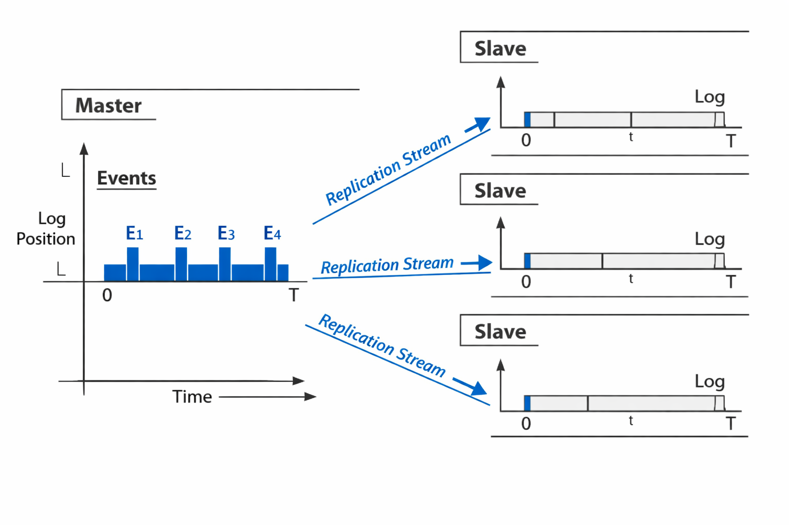

# From Analogy to Algorithm: A Five-Phase Primer on Master-Master and Master-Slave Replication

This report presents a definitive study guide on the availability patterns of Master-Master and Master-Slave replication. It is structured according to a "Chain of Knowledge" progression, moving from foundational concepts to deep, first-principles physics. The scope is deliberately focused on these two replication topologies, excluding explicit discussions of active-active and active-passive failover models as primary subjects, though their distinctions are clarified where necessary for pedagogical completeness. The content is designed to be MECE (Mutually Exclusive, Collectively Exhaustive) within its defined boundaries, providing a rigorous framework for engineers to understand, select, and implement these critical patterns in distributed systems.

---

## Foundations: Motivation, Definitions, and Mental Models

The drive to build resilient, scalable, and highly available software systems has led to the widespread adoption of data replication. At its core, replication is the practice of maintaining multiple copies of data across different nodes in a network. This chapter establishes the fundamental motivations for using replication, provides unambiguous definitions of the key terms—Master-Slave and Multi-Master—and introduces intuitive mental models to demystify these concepts for beginners. Understanding this foundation is crucial before delving into the complexities of implementation and failure modes.

The primary motivations for implementing a replicated data architecture are twofold: scalability and availability . Scalability, particularly read scalability, is a key benefit of replication. In many applications, such as social networks or e-commerce search platforms, the number of read operations vastly exceeds the number of write operations . By designating a single node as the master to handle all writes, the system can distribute the read load across multiple slave nodes . This allows the total read throughput of the system to grow horizontally simply by adding more slaves, directly addressing performance bottlenecks caused by high traffic . Second, replication provides fault tolerance, which is essential for achieving high availability . If a single database server were the sole source of truth, its failure would render the entire service unavailable for writing and potentially reading data. By maintaining copies of the data on other servers, the system can survive the failure of one or more individual nodes, ensuring continuous operation and protecting against data loss .

To proceed with precision, it is essential to define the core architectural patterns being discussed. These definitions form the bedrock upon which all subsequent analysis is built.

**Master-Slave Replication**, also known as Primary-Replica or Leader-Follower replication, is an architectural pattern where a designated master node is the single point of authority for all write operations (INSERT, UPDATE, DELETE) . All other nodes in the system, known as slaves, replicas, or standbys, maintain a copy of the master's data . Changes made on the master are propagated to the slaves, which then apply those changes to their own datasets to stay synchronized . This model is often chosen for workloads that are predominantly read-heavy, as it simplifies consistency management by eliminating concurrent writes on the master . The simplicity of having a single write point makes it easier to reason about data state and manage conflicts, making it a popular choice for applications like analytics workloads and read-heavy SaaS platforms . Several major databases, including MySQL, PostgreSQL, and Redis, provide built-in support for this topology .

**Multi-Master Replication**, sometimes referred to as peer-to-peer replication, is a variation where any node in the cluster can accept both read and write operations . All nodes are considered equal peers, and there is no single designated master . When a change is made on any node, it is propagated to all other nodes in the group, allowing for distributed write capability . This architecture offers superior scalability for write-heavy workloads and improved fault tolerance compared to the master-slave model . However, this flexibility comes at the cost of increased complexity, primarily in the area of **conflict resolution**. Since multiple nodes can modify the same piece of data concurrently, mechanisms must be in place to detect and resolve these conflicts to ensure data integrity . Conflict resolution strategies can range from simple Last-Write-Wins based on timestamps to more complex, application-specific logic or the use of Conflict-free Replicated Data Types (CRDTs) . PostgreSQL supports multi-master configurations through extensions like Bi-Directional Replication (BDR), which uses logical replication to achieve this distributed write model . MySQL Group Replication also offers a multi-primary mode, operating on an eventual consistency model .

To build an intuitive understanding before diving into technical details, consider the following non-technical analogies:

*   **Master-Slave Replication as a Broadcast News Network:** Imagine the master as a central news bureau. Reporters (the application) send all their stories (write transactions) to this bureau. The bureau compiles the day's news and broadcasts a continuous feed (the Write-Ahead Log or Binary Log) over a cable network . Subscribers (replicas/slaves) receive this feed and watch it live to update their own local news archives . They can then serve requests for today's headlines (read queries) from their local archive. If the main news bureau is temporarily unreachable, new stories cannot be officially recorded, but subscribers can still answer questions about the news they have already received . This model ensures that all subscribers eventually get the same story in the same order, but there might be a delay between when a story is filed and when it appears on a subscriber's screen.

*   **Multi-Master Replication as a Collaborative Digital Whiteboard:** Picture a group project where multiple people are collaborating on a single digital whiteboard. In this model, any participant can draw or write anywhere on the board at any time (distributed writes) . Every action taken by one person is instantly broadcast to everyone else, who then sees the change appear on their own screen . This allows for maximum parallelism and collaboration. However, problems arise if two people try to write on the exact same spot at the same time. The system needs a rule to decide what happens—for instance, whoever finishes drawing second gets to keep their version, erasing the first person's work (Last-Write-Wins) . This is analogous to the conflict resolution challenge inherent in multi-master systems .

These analogies capture the essence of the two patterns. The Master-Slave model prioritizes a single, orderly flow of information, while the Multi-Master model prioritizes freedom and parallelism, accepting the need for rules to resolve inevitable collisions.

> ⚠️ **Anti-Pattern: Confusing Topology with Consistency Model**
>
> A common beginner mistake is to conflate the replication topology (Master-Slave vs. Multi-Master) with the consistency model (strong vs. eventual). While a Master-Slave setup with synchronous replication provides strong consistency, a Multi-Master setup with a robust conflict resolution mechanism can also provide strong guarantees. The topology defines the structure of the nodes, while the replication mode (asynchronous, semi-synchronous, synchronous) and conflict resolution strategy define the consistency guarantees .

> 🔑 **Key Takeaway:** Replication is used to achieve scalability and availability. Master-Slave replication centralizes writes for simplicity and strong write consistency, while Multi-Master replication distributes writes for higher scalability at the cost of increased complexity in conflict resolution.

---

## Mechanics: Breaking Points and Standard Trade-Offs

Moving beyond the idealized "happy path," this phase examines the practical realities of running replicated systems. Every design choice carries inherent trade-offs, and understanding the "breaking points"—the moments when a system behaves differently than expected under stress—is critical for building robust applications. This section explores the standard patterns, metrics, and anti-patterns associated with Master-Slave and Multi-Master architectures, providing an intermediate-level view of their operational mechanics.

A primary breaking point in any replication system is **master failure**. In a Master-Slave architecture, the master is a single point of failure for all write operations; if it crashes, the system becomes read-only until a new master is elected . This necessitates a process called **failover**, where one of the slaves is promoted to become the new master . The speed and reliability of this process directly impact the system's Recovery Time Objective (RTO)—the target time to restore service after a failure . The potential for data loss during this process is measured by the Recovery Point Objective (RPO), which quantifies the maximum acceptable amount of data loss, typically measured in time . The RPO is heavily influenced by the replication mode. In a fully asynchronous setup, any transaction committed on the master that has not yet been transmitted to the slave is lost, resulting in an RPO measured in seconds or longer . Using semi-synchronous replication, where the master waits for at least one slave to acknowledge receipt of the transaction log before committing, can reduce the RPO to near-zero, as only unacknowledged transactions are at risk . Promoting a slave as the new master results in an RPO of zero for the transactions it had already received, whereas restoring from a backup could lead to an RPO of hours .

Another pervasive breaking point is **replication lag**. This is the delay between a transaction being committed on the master and the corresponding change being applied on the slave(s) . Lag is an unavoidable consequence of network latency and the processing overhead required to apply changes on the replica . Even in a healthy system, lag means that reads served from a slave may return stale data, violating the user's expectation of immediate consistency . This leads to a specific problem known as **read-after-write inconsistency**, where a user who just wrote some data might query a slave and not see their own update reflected in the result . The magnitude of lag can vary significantly. In MySQL, for example, since the slave SQL thread is single-threaded, a single slow query running on the slave can cause the entire replication stream to pause for the duration of that query, creating a lag of several seconds or more . High disk queue depth on either the master or slave can also be a direct indicator of I/O bottlenecks causing replication to slow down .

The most severe failure mode, particularly for Multi-Master and poorly configured Master-Slave systems, is **split-brain**. This occurs when a network partition divides the cluster into isolated groups, and each group independently decides it has become the new master, leading both sides to accept writes simultaneously . This creates divergent data histories that are extremely difficult, if not impossible, to reconcile automatically . For example, if two masters independently allocate the next auto-increment ID, promoting both back into service will result in duplicate primary keys and conflicting data states . Split-brain is a direct consequence of the FLP impossibility result, which proves that in an asynchronous system, it is impossible to build a perfect failure detector that can always distinguish between a crashed node and a slow one . Any timeout-based detection mechanism is therefore inherently flawed, making split-brain a fundamental challenge in distributed systems . The primary defense against split-brain is a combination of quorum-based agreement and fencing .

To manage these challenges, the industry has standardized on three primary replication modes, each offering a different balance of performance and durability:

| Mode | Description | Latency Impact | Durability Guarantee (on master crash) | Typical Use Case |
| :--- | :--- | :--- | :--- | :--- |
| **Asynchronous** | The master commits a transaction and sends the log change to the slave(s) without waiting for any acknowledgment.  | Lowest. Write performance is limited only by the master's local processing. | Low. Any transaction not yet sent to a slave is lost. RPO is non-zero.  | Read-heavy workloads where some data loss is acceptable for the sake of maximum write performance.  |
| **Synchronous** | The master blocks and waits for an acknowledgment from at least one slave confirming that it has persisted the transaction log change before committing.  | Highest. Write performance is reduced by the round-trip time (RTT) to the synchronously replicating slave.  | High. Zero data loss is guaranteed for transactions acknowledged by the slave.  | Write-heavy workloads requiring strong durability guarantees, often colocated within the same data center.  |
| **Semi-Synchronous** | A hybrid approach where the master waits for at least one slave to acknowledge receiving the log change (but not necessarily applying it) before committing. If no acknowledgment is received within a timeout, it falls back to asynchronous mode.  | Medium. Write performance is lower than asynchronous but higher than synchronous.  | Higher than asynchronous. Guarantees the transaction is durable on at least one remote replica, minimizing RPO.  | A balanced approach for systems needing better durability than asynchronous replication but unable to tolerate the full latency penalty of synchronous replication.  |

The physical placement of replicas relative to the master is a critical strategic decision. Co-locating a semi-sync replica in the same data center as the master minimizes write latency but offers no protection if the entire data center fails . Placing it in a remote data center increases write latency due to network RTT but provides a higher chance of preserving data in the event of a site-wide disaster . This trade-off between latency and durability is a recurring theme in distributed system design.

Several key metrics are used to monitor the health and performance of a replicated system:

*   **Replication Lag:** Measured in seconds, this is the difference in time between the master's timestamp and the slave's application of a given transaction . It can also be measured by comparing WAL positions.
*   **Recovery Point Objective (RPO):** As defined earlier, this is the maximum acceptable window of data loss, dictated by the replication mode and failover strategy .
*   **Recovery Time Objective (RTO):** The target time to recover services after a failure, influenced by how quickly a failover can be detected and executed .
*   **DiskQueueDepth:** On cloud instances like AWS RDS, this metric indicates how many I/O requests are waiting to be processed by the underlying storage system. A consistently high value signals that the storage IOPS capacity is being exceeded, leading to increased latency and CPU wait times .

Understanding these mechanics and trade-offs is the first step toward designing a system that can gracefully handle failures and perform reliably under load.

> ⚠️ **Anti-Pattern: Manual Failover Without Fencing**
>
> Manually promoting a standby to be the new master without first taking steps to ensure the old master is completely offline is a frequent cause of split-brain . If the old master comes back online and is not properly isolated, it may resume accepting writes, unaware that another master now exists. This leads to data divergence. Automated failover tools mitigate this risk by incorporating fencing—a mechanism to prevent the old master from writing—before promoting a new one .

> ⚠️ **Anti-Pattern: Ignoring WAL Purgation**
>
> In streaming replication setups like PostgreSQL's, the master retains Write-Ahead Log (WAL) files for a certain period to allow slaves to catch up. If a slave falls too far behind, it may request a WAL segment that the master has already recycled and purged. This causes a fatal replication error, requiring manual intervention like cloning the slave from the master again . This subtle but critical issue highlights the importance of monitoring replication lag and having procedures in place to handle such failures.

> 🔑 **Key Takeaway:** Replication introduces breaking points like master failure, replication lag, and split-brain. The choice of replication mode (asynchronous, semi-synchronous, synchronous) involves a fundamental trade-off between write performance, data durability, and availability, governed by metrics like RPO and RTO.

---

## Scale: Systemic Behavior and Real-World Failures

At scale, the manageable breaking points observed in smaller systems evolve into systemic behaviors and catastrophic failures driven by the harsh realities of distributed computing: network partitions, geographical latency, and operational complexity. This phase moves from the mechanics of a single cluster to the behavior of systems spanning multiple data centers. It examines how replication patterns behave in a global context, illustrates the devastating consequences of mismanagement through a detailed post-mortem, and catalogs the anti-patterns that plague large-scale deployments.

When replication spans multiple geographic locations, network latency becomes a dominant factor. The round-trip time (RTT) between data centers can range from tens to hundreds of milliseconds, making synchronous replication prohibitively expensive for cross-region writes . Consequently, long-distance replication is almost always asynchronous, which exacerbates replication lag and increases the window for data loss in case of a failure . More critically, network partitions—the complete failure of communication between two parts of the cluster—are no longer theoretical edge cases; they are an expected part of operating at scale . During a partition, each isolated group of nodes loses contact with the others, creating the exact conditions for a split-brain scenario . Preventing split-brain in this environment requires sophisticated coordination mechanisms. Quorum-based systems are a primary defense; by requiring a majority of nodes to agree on a state change, a system can ensure that only one partition of the cluster can continue operating while the minority partition is rendered incapable of committing writes or electing a leader . This is why distributed databases often use an odd number of nodes (e.g., 3 or 5) to easily determine a majority .

The following post-mortem provides a stark, real-world illustration of these principles in action.

> 💥 **Post-Mortem: GitHub (October 21, 2018)**
> During a routine maintenance task on a database cluster, a human operator manually intervened in the replication setup. This action inadvertently broke a replication loop, causing a cascading failure that resulted in a split-brain condition . Two separate database nodes began to operate as independent masters, each accepting writes and believing it was the authoritative source of truth. This created conflicting and divergent data sets that could not be automatically merged . The reconciliation process proved to be extraordinarily complex and time-consuming, requiring hours of manual effort by the engineering team to analyze the divergent states and attempt to merge the data correctly . The incident highlighted the extreme difficulty and operational burden of data reconciliation after a split-brain event and underscored the critical importance of automating failover processes with built-in fencing to prevent such scenarios from occurring in the first place .

This incident serves as a powerful pedagogical tool, demonstrating how a seemingly small, manual deviation from standard procedure can trigger a systemic failure with massive operational consequences. It validates the theoretical risks discussed previously with empirical evidence from a major technology company.

Operating at scale also exposes several anti-patterns that stem from a misunderstanding of replication's limitations:

*   **Over-reliance on Human Operators:** The GitHub outage is the canonical example of this anti-pattern. Manual interventions for tasks like failover are prone to error, introduce significant latency, and lack the deterministic safety mechanisms (like fencing) that automated systems provide . At scale, automation is not a luxury but a necessity for reliability.
*   **Inadequate Fencing:** As seen in the GitHub case, the failure to isolate the old master after a failover is a direct path to split-brain . Fencing is the process of ensuring an old master cannot receive or process writes after it has been demoted. Common fencing methods include STONITH (powering off the machine), using distributed locks or leases to invalidate the old master's credentials, or using lossless semi-synchronous replication to ensure the old master is aware of its demotion .
*   **Misunderstanding Semi-Synchronous Replication:** A common misconception is that placing a semi-sync replica in a different data center provides full durability against a site failure. While this does protect against a regional outage, it introduces a significant data loss risk. If the primary data center and its nearest semi-sync replica suffer a simultaneous failure (e.g., a power outage), the replicas in the other data center will never have received the latest transactions, leading to data loss upon failover .
*   **Ignoring Operational Nuances:** A subtle but critical failure mode is the inability of a slave to catch up due to WAL purgation. In a PostgreSQL streaming replication setup, if a slave falls so far behind that it requests a WAL file that the master has already recycled, the replication connection will terminate with a fatal error . This requires a manual recovery procedure, such as re-cloning the slave from a current backup of the master, highlighting the operational complexity of managing long-term replication health .
*   **Insufficient Monitoring:** Without proper monitoring of metrics like replication lag, DiskQueueDepth, and network connectivity, teams may remain unaware of creeping problems until they escalate into a major outage. High `DiskQueueDepth`, for instance, is a clear signal of I/O saturation that can silently degrade replication performance .

The architectural fix for these issues lies in adopting robust, automated, and fenced failover solutions. Tools like Patroni for PostgreSQL, Orchestrator for MySQL, Stolon, and Keepalived are industry-standard open-source projects designed to manage the complex state transitions of a replicated database cluster . These systems integrate health checks, quorum-based leader election, and fencing mechanisms to automate failover in a way that is deterministic and safe, thereby preventing the kinds of human-error-induced split-brain scenarios that plagued early distributed systems.

> ⚠️ **Anti-Pattern: Assuming Asynchronous is Always "Good Enough"**
>
> Choosing asynchronous replication for all deployments because it offers the best write performance is a dangerous oversimplification. Many applications, even those perceived as less critical, have implicit or explicit requirements for data durability. Assuming asynchronous replication is sufficient without a thorough understanding of the application's RPO is a recipe for customer-facing data loss incidents .

> 🔑 **Key Takeaway:** At scale, replication systems are constantly challenged by network partitions and geographical latency. The GitHub outage demonstrates that manual failover is a critical anti-pattern, and the solution is to implement automated, fencing-aware orchestration to prevent split-brain and ensure reliable, predictable behavior.

---

## Physics: First Principles Grounding and Mathematical Formulation

This phase moves from the software abstractions of replication to the underlying physical and mathematical constraints that govern their behavior. Understanding how concepts like replication lag and durability are rooted in hardware limitations (disk IOPS, network RTT) and mathematical laws (queuing theory) provides a deeper, more predictive understanding of system performance. This knowledge is essential for designing systems that are not just correct in theory but performant and scalable in practice.

The performance of any replicated system is fundamentally bounded by the capabilities of its constituent hardware components. Let's examine the key bottlenecks:

**Storage (Disk IOPS):** The storage subsystem is often the first bottleneck in a database workload. Both master and slave nodes generate significant I/O. The master must perform `fsync` operations to ensure data durability, and the slave must replay incoming log entries, which also involve I/O. If the rate of I/O requests exceeds the storage system's provisioned Input/Output Operations Per Second (IOPS), requests begin to queue up. This is quantified by the **DiskQueueDepth** metric, which measures the number of pending I/O operations . A high `DiskQueueDepth` is a direct symptom of insufficient IOPS, leading to increased latency and, consequently, replication lag . The CPU itself can become a bottleneck, as it spends more time in an `IO_WAIT` state, idling while waiting for I/O operations to complete . Therefore, the choice of storage type (e.g., SSD vs. HDD) and size directly impacts the maximum achievable replication throughput.

**Network (Round-Trip Time - RTT):** Network latency imposes a hard limit on the performance of synchronous and semi-synchronous replication. In a synchronous configuration, every write on the master must wait for a response from a replica, a process that takes at least twice the network RTT (one-way transit time plus the reply time) . For example, replicating between two data centers separated by 50ms of network latency would add a minimum of 100ms of delay to every write. This is why synchronous replication is almost always restricted to replicas located within the same data center or even on the same rack as the master—to minimize RTT and preserve write performance .

**Computation (CPU Caches and Serialization):** The process of generating and applying logs is computationally intensive. On the master, the database must serialize the changes of a transaction into the Write-Ahead Log (WAL) or Binary Log . On the slave, the relay log must be deserialized and the corresponding changes applied to the data tables, a process that involves parsing SQL statements or logical decoding of WAL records . These serialization/deserialization tasks consume CPU cycles. Furthermore, under heavy load, contention for CPU caches and memory bandwidth can become a bottleneck, slowing down the overall processing of transactions on both master and slave . In Multi-Master systems using logical replication, this CPU overhead is present on every node, as all nodes must process all incoming writes .

These physical constraints are not just qualitative observations; they can be described and predicted using mathematical models from queuing theory. One of the most important is **Kingman's approximation**, which describes how waiting time in a queue grows as the system's utilization approaches its capacity. The formula is:
$$
E[W] \approx \frac{\rho}{1 - \rho} \cdot \frac{C_a^2 + C_s^2}{2} \cdot E[S]
$$
Where $E[W]$ is the average waiting time in the queue, $\rho$ is the utilization ($\lambda / \mu$, or arrival rate divided by service rate), $C_a^2$ is the squared coefficient of variation of the inter-arrival times, $C_s^2$ is the squared coefficient of variation of the service times, and $E[S]$ is the average service time . A key insight from this formula is that as utilization ($\rho$) approaches 1 (or 100%), the waiting time $E[W]$ grows towards infinity. This provides a quantitative anchor for the adage "don't let your disks get full." In practical terms, once a system's utilization exceeds **>70%**, tail latencies begin to grow exponentially, leading to unpredictable performance degradation .

Another fundamental concept is **Little's Law**, which provides a relationship between the average number of items in a system, the average arrival rate, and the average time an item spends in the system. It is often expressed as **$L = \lambda W$** . We can adapt this to model replication lag. Here, $L$ becomes the replication lag (the number of unapplied transactions in the queue), $\lambda$ is the rate at which transactions are arriving on the slave, and $W$ is the average time it takes the slave to apply a transaction. This formula makes it clear that lag will increase if the arrival rate of transactions exceeds the slave's ability to apply them (i.e., if the service rate is too low). This can happen due to a slow slave, a burst of writes on the master, or a long-running blocking operation on the slave that pauses the SQL execution thread .

Finally, the behavior of semi-synchronous replication can be modeled with a simple timeout-based logic. In MySQL, the master will wait for an acknowledgment from a semi-sync replica for up to `rpl_semi_sync_master_timeout` seconds . If an acknowledgment is not received within this period, the master assumes the replica is unreachable or too far behind and falls back to asynchronous mode for that transaction . The configuration `rpl_semi_sync_master_wait_for_slave_count` determines how many replicas must acknowledge the receipt of the log changelog before the primary server's commit is finalized .

By grounding our understanding in these physical and mathematical principles, we move from a descriptive to a predictive engineering discipline. We can anticipate performance bottlenecks, set realistic expectations for latency and throughput, and design systems that are robust not just against failures but against predictable performance degradation under load.

> 📊 **Formula: Kingman's Approximation**
> $$E[W] \approx \frac{\rho}{1 - \rho} \cdot \frac{C_a^2 + C_s^2}{2} \cdot E[S]$$
> [Source: J. Dean and L. A. Barroso's paper "The Tail at Scale"] 

> 📊 **Formula: Little's Law (Applied to Replication Lag)**
> $$L = \lambda W$$
> Where $L$ is the replication lag (queue length), $\lambda$ is the transaction arrival rate on the slave, and $W$ is the average time to apply a transaction. 
> [Source: Analysis of Queuing Systems]

> ⚠️ **Anti-Pattern: Overlooking the Speed of Light**
>
> In globally distributed systems, the speed of light imposes a fundamental limit on network latency. Data cannot travel faster than approximately 200,000 km/s in fiber optic cables. This means that replicating data across continents (e.g., between Virginia and Singapore) will always have a minimum RTT of around 100-150ms, making low-latency synchronous replication physically impossible . Designing systems that require real-time consistency across such distances without acknowledging this constraint is a violation of first principles.

> 🔑 **Key Takeaway:** The performance of replicated systems is constrained by physical limits on disk IOPS, network RTT, and CPU speed. Mathematical models like Kingman's approximation and Little's Law provide quantitative anchors for predicting latency and understanding the origins of replication lag, transforming replication design from an art into a science.

---

## Synthesis: Application and Decision Framework

The final phase synthesizes the knowledge gained from the preceding sections into a practical decision-making framework. After exploring the foundational concepts, mechanical realities, systemic failures, and first principles of replication, this chapter provides a clear decision matrix and a set of mental checkpoints. These tools empower engineers to navigate the complex trade-offs involved in selecting and implementing a replication strategy tailored to their specific application's requirements for consistency, availability, and scalability.

The choice between Master-Slave and Multi-Master replication is not a matter of one being universally superior; rather, it is a strategic decision based on the unique demands of the workload and the tolerance for complexity. The following decision matrix provides a structured comparison to guide this selection process.

| Criterion | Choose Master-Slave Replication When... | Choose Multi-Master Replication When... |
| :--- | :--- | :--- |
| **Workload Pattern** | The workload is predominantly **read-heavy** . Scaling read capacity by adding slaves is the primary goal. | The workload is **write-heavy** and benefits from distributing the write load across multiple nodes . |
| **Consistency Requirement** | Strong write consistency is required, and the complexity of conflict resolution is undesirable . A single write point simplifies reasoning about data state . | The application can tolerate **eventual consistency** and has a well-defined strategy for handling and resolving conflicts arising from concurrent writes . |
| **Geographic Distribution** | Clients are concentrated in one region, or reads need to be served close to users without requiring distributed writes. | There are geographically distributed clients who require **low-latency writes** local to their region . |
| **Fault Tolerance Goal** | Fault tolerance is needed primarily to protect against the failure of a single server. | Resilience against **regional outages** is a primary requirement, and the system needs to remain writable even if an entire data center fails . |
| **Operational Complexity** | Simplicity of design and operation is valued. Managing a single write point and avoiding conflicts is easier . | The team possesses the expertise to manage a more complex architecture, including conflict detection, monitoring for split-brain, and data reconciliation . |

This matrix distills the core trade-offs into actionable criteria. For instance, a social media platform serving millions of profile views per second but with relatively few posts per user would be an excellent candidate for a Master-Slave architecture, using slaves to handle the massive read load . Conversely, a collaborative document editing tool where multiple users need to edit the same document simultaneously would be a natural fit for a Multi-Master model, provided it implements a sophisticated conflict resolution mechanism like Operational Transformation or CRDTs .

Beyond choosing a topology, the true test of mastery lies in asking the right questions throughout the design process. The following mental checkpoints are designed to provoke deep thinking and force a confrontation with the fundamental trade-offs and failure modes discussed in this guide. Before finalizing any replication strategy, an engineer should be able to confidently answer these questions.

1.  **What is our application's Recovery Point Objective (RPO)?** Can we afford to lose seconds, minutes, or hours of data in the event of a failure? This question dictates the replication mode (asynchronous, semi-synchronous, or synchronous) and the robustness of our backup and failover strategy. A banking application might demand an RPO of zero, necessitating synchronous replication, while a logging system might tolerate an RPO of hours .

2.  **How do we guarantee we will never experience a split-brain?** Given that perfect failure detection is impossible, what is our concrete plan to prevent two masters from ever writing concurrently? This forces a focus on automated, fencing-aware failover orchestration rather than manual procedures. The answer should involve mechanisms like distributed locks, leases, or quorum-based protocols that are built into the replication manager .

3.  **Is replication lag acceptable for our most critical user journeys?** Will our users be impacted by stale reads or the inability to see their own writes immediately? If strong read consistency is required, the design may need to route certain queries exclusively to the master, even if it reduces overall scalability. Alternatively, it may necessitate the use of synchronous replication, which increases write latency .

4.  **What is our strategy for conflict resolution, and what are the business implications of a conflict?** For Multi-Master systems, this question is paramount. The chosen strategy (e.g., Last-Write-Wins) must be carefully evaluated. Does silent data loss from an LWW conflict pose a business risk? Or is it preferable to flag the conflict for manual review? The answer depends entirely on the application domain .

5.  **What are the first-principles physical limits of our infrastructure?** How will our choice of replication affect our disk IOPS, network RTT, and CPU utilization? Are we designing a system that will gracefully degrade under load, or are we pushing against the fundamental limits of our hardware, setting the stage for future performance crises? This question grounds the abstract design in the physical reality of the deployed environment .

By internalizing the insights from each phase of this guide—from the simple mental models of Phase 1 to the rigorous physics of Phase 4—and applying them through the decision matrix and mental checkpoints of this final phase, engineers can develop a holistic and robust approach to designing availability patterns. The goal is not merely to choose a replication topology, but to architect a system that is resilient by design, predictable in its behavior, and aligned with the true business requirements for data and service availability.

> 🔑 **Key Takeaway:** The choice between Master-Slave and Multi-Master replication is a strategic trade-off determined by workload characteristics, consistency needs, and operational capacity. A successful implementation requires a rigorous decision-making process guided by a clear understanding of RPO, a foolproof strategy to prevent split-brain, and an awareness of the physical and mathematical limits of the underlying infrastructure.