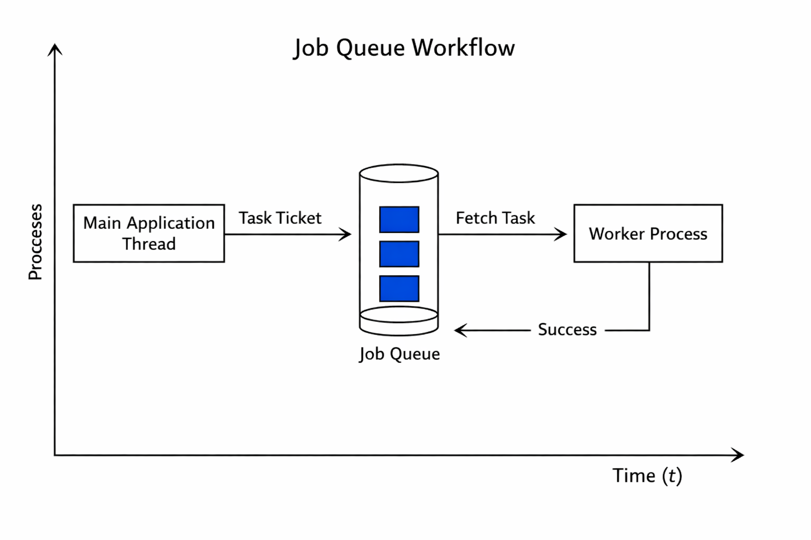
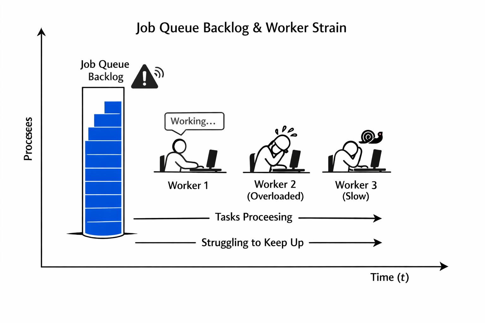

# From Kitchen Timer to Cosmic Clock: A First-Principles Guide to Reliable Scheduling at Scale

## PHASE 1: THE FOUNDATION

Schedule-driven background jobs represent a fundamental architectural pattern for building scalable and responsive systems. This phase establishes the core motivation, provides clear definitions, introduces intuitive mental models, and describes the idealized "happy path" operation. The objective is to build a solid conceptual base before introducing complexities, breaking points, and distributed realities. We will use simple analogies to demystify the concept, grounding it in everyday experiences before transitioning to more precise technical language.

The central problem that background jobs solve is the conflict between time-sensitive user-facing operations and long-running, non-critical administrative tasks. In a typical web application, when a user performs an action—like uploading a file or placing an order—the system must respond quickly to maintain a good user experience. If this request requires a lengthy process, such as generating a complex report, resizing an image, sending a notification via email, or performing a database backup, blocking the main application thread would lead to high latency and poor scalability . This is where background jobs become essential. They allow the main application to offload these heavy-lifting tasks to a separate execution context, enabling it to acknowledge the user's request immediately and continue processing other work. This separation of concerns is the primary motivation for using background jobs; it decouples immediate operational needs from deferred, asynchronous work, thereby improving both responsiveness and system resilience.

To understand this concept intuitively, consider a busy restaurant kitchen. The head chef (the main application thread) is responsible for preparing the dishes ordered by customers at their tables (user requests). While the head chef is focused on the current orders, there are other necessary tasks: cleaning up the prep area, ordering new ingredients from a supplier, or starting the slow-cooking stock for tomorrow's special. These tasks are important for the kitchen's operation but do not need to be done instantly. A modern kitchen employs a dedicated team of line cooks and prep chefs who handle these background tasks independently of the head chef's workflow . When the head chef needs a specific ingredient prepared, they place an order on a ticket (a message in a queue), and the prep chef takes care of it without disrupting the head chef's focus on the immediate customer orders. Once the prep work is done, the finished ingredient is available for use. This model ensures that the kitchen can serve customers efficiently while still managing its internal maintenance and preparation work. Similarly, a background job scheduler acts like the kitchen's management system, assigning tasks to available workers (background processes) so the main application can remain agile and focused.

This leads us to the core definitions. A **Background Job** is a discrete unit of work that is executed asynchronously, independent of the primary application flow that initiated it . Its lifecycle is managed separately, often through a dedicated service or framework. A **Job Scheduler** is the component responsible for determining when a background job should be executed. It enforces the temporal logic, such as running a job every hour, daily at a specific time, or once after a certain delay. The most basic form of scheduling is **cron-style**, which uses a cron expression—a string representing a schedule—to trigger jobs periodically . For example, a cron job might run a script every day at 2:00 AM to generate a daily sales report. More advanced schedulers, like **Kubernetes CronJobs**, provide richer semantics, such as handling missed schedules and managing the lifecycle of the job runs they create . Finally, **Deadline-Driven Task Queues** represent a sophisticated category of schedulers that manage tasks not just by their start time, but by their deadlines, ensuring that time-critical operations are prioritized . Temporal is a prominent example of a durable execution engine that operates on this principle, orchestrating complex workflows with strict temporal constraints .

In the simplest case, under low load and with no failures, the "happy path" of a schedule-driven background job is straightforward. The job scheduler, running continuously, evaluates its set of scheduled tasks against the current system time at regular intervals. When the current time matches the schedule for a particular job, the scheduler instructs the system to launch a new worker process or container to execute the job . This worker acquires any necessary resources, executes the job's code, and upon completion, reports its status back to the scheduler (e.g., "success" or "failure"). The scheduler then cleans up the completed worker process. For a simple cron job running on a single server, this entire cycle happens predictably and reliably. For instance, a job configured to run every Sunday morning at 3:00 AM successfully executes, completes its small dataset processing task within seconds, and exits cleanly, ready to be triggered again the following week . In this ideal scenario, there are no resource contention issues, no network partitions, and no unexpected errors. The system behaves deterministically, fulfilling its purpose with minimal fuss. This happy path represents the baseline expectation, but real-world systems quickly introduce variables that challenge this simplicity.

---

> 🔑 **Key Takeaway:** Schedule-driven background jobs are a critical architectural pattern for decoupling time-sensitive operations from long-running tasks, thereby enhancing system responsiveness and scalability. They function by offloading work to independent worker processes managed by a dedicated scheduler.

## PHASE 2: THE REALITY

While the "happy path" provides an idealized view, production systems operate in a state of constant flux, facing challenges like increased load, partial failures, and resource contention. This phase moves beyond theoretical perfection to explore the "reality" of running schedule-driven jobs. We will examine the breaking points of naive implementations, introduce industry-standard patterns for building robust systems, and define the key metrics used to monitor their health. The central theme of this phase is resilience: designing systems that can gracefully handle failure rather than catastrophically failing.

One of the most significant breaking points in any background job system is the assumption that a job will run exactly once. In a distributed environment with retries, horizontal scaling, and potential node failures, duplicate executions are not anomalies; they are expected events that must be handled correctly . A job that deposits funds into a user's account, for example, should not deposit them twice if it fails partway through and is retried. This is where the concept of **idempotence** becomes paramount. An idempotent operation is one where executing it multiple times produces the same result as executing it once . In the context of background jobs, this means a job's logic must be designed to be safe against retries and concurrent runs . Implementing idempotency often involves using unique identifiers for each job execution and tracking which identifiers have already been processed. Stripe's documentation strongly advocates for the use of idempotency keys on all POST requests to prevent accidental duplicate charges, a principle that directly applies to durable background jobs . Without idempotency, even a simple retry mechanism can lead to severe data corruption, financial loss, or inconsistent system states . Therefore, designing for idempotency is arguably the single most important property of a production-grade background job .

Another major breaking point occurs when the rate of incoming jobs exceeds the capacity of the workers to process them. This situation manifests as a growing **queue backlog** . As the number of pending jobs increases, the average waiting time for a job to be picked up by a worker also grows, leading to increased end-to-end latency. If left unchecked, this can cause timeouts in dependent services, exhaust memory on the queueing backend (like RabbitMQ or Kafka), and eventually lead to a cascading failure across the entire system . A common anti-pattern is to simply add more worker instances to "solve" the problem. However, this can be ineffective if the root cause is that worker startup time is longer than the rate at which new jobs are arriving . The system enters a death spiral where new workers are launched only to find themselves immediately overwhelmed. A more nuanced approach is required, involving proper scaling strategies, potentially including a "warm pool" of pre-warmed workers, and implementing mechanisms like **backpressure**. Backpressure is a flow control technique where the consumer (worker) signals to the producer (queue) that it is struggling, prompting the queue to slow down or stop accepting new messages temporarily to allow the consumer to catch up .

Given these challenges, the industry has developed several standard patterns for building reliable job processing systems. At the most basic level, developers might use a simple cron daemon on a single machine . This approach is suitable for trivial, non-critical tasks where failure is acceptable. For more demanding applications, a dedicated **queuing system** is the standard choice. Systems like Celery with Redis/RabbitMQ, Apache Kafka, or Amazon SQS provide durability guarantees, meaning messages are persisted to disk and survive broker restarts . These systems offer features like message acknowledgment, dead-letter queues for failed jobs, and various delivery guarantees (at-most-once, at-least-once, exactly-once). However, they typically lack built-in state management for long-running, multi-step processes. For orchestrating complex workflows that span hours or days, a **durable execution engine** like Temporal is increasingly favored . Unlike a simple queue, Temporal treats a workflow as a first-class entity that maintains its state durably. It provides powerful primitives like automatic retries with exponential backoff, timeouts, and cancellation, ensuring that complex business logic executes reliably even in the face of infrastructure failures . The choice of pattern depends heavily on the specific reliability and complexity requirements of the workload.

To effectively manage and troubleshoot these systems, a set of key performance indicators (KPIs) and metrics must be monitored. These metrics provide visibility into the health and performance of the job processing pipeline. A dashboard for monitoring a job queue-driven system should include panels for:
*   **Successful Webhook Processing Rate:** The number of jobs completed per minute/hour.
*   **Queue Backlog:** The number of unprocessed jobs waiting in the queue. This is a primary indicator of system overload .
*   **Worker Health:** The number of active, healthy worker instances versus crashed or restarting ones .
*   **Message Processing Time:** The average duration from when a job is dequeued to when it is successfully completed.
*   **Error Rates:** The count of jobs that have failed and potentially ended up in a dead-letter queue .
For Kubernetes CronJobs specifically, additional metrics are crucial, such as tracking the last successful run time and alerting on missed schedules, which can indicate underlying issues like clock drift or controller-manager problems . Tools like Prometheus and Grafana are commonly used to collect and visualize these metrics, providing operators with the insights needed to react to and prevent outages .

> ⚠️ **Anti-Pattern: Ignoring Idempotency**
> Description: Assuming a job will only ever run once and writing business logic that depends on this assumption.
> Consequence: Duplicate executions due to retries, scaling events, or scheduler bugs can lead to data corruption, financial loss, and inconsistent system states .

> ⚠️ **Anti-Pattern: Misinterpreting Queue Backlog**
> Description: Seeing an increasing queue backlog and automatically assuming the solution is to spin up more workers.
> Consequence: This can fail if worker startup time is slower than the job arrival rate, exacerbating resource contention and potentially causing a cascading failure .

---

> 🔑 **Key Takeaway:** Production background job systems must be designed for failure. Idempotency is a non-negotiable requirement for correctness, and monitoring queue backlog, worker health, and error rates is essential for maintaining system stability under load.

## PHASE 3: THE SCALE

As systems grow in size and complexity, moving from a single-server deployment to a distributed architecture spanning multiple nodes and data centers, the challenges associated with schedule-driven background jobs intensify exponentially. This phase delves into the distributed context, exploring how factors like clock synchronization become critical failure points. We will analyze a documented public post-mortem from a major technology company to illustrate the catastrophic consequences of mismanaging scheduled jobs at scale. Finally, we will identify common anti-patterns that engineers fall into when attempting to scale these systems and the systemic consequences of those mistakes.

In a distributed system, every node has its own local clock. Due to variations in hardware oscillators and environmental conditions, these clocks inevitably drift apart over time. This phenomenon, known as **clock drift**, is not a bug but a physical reality in distributed computing . Even minor discrepancies can have severe consequences for systems relying on timestamps for coordination, ordering, or authentication . For a schedule-driven job, clock drift can lead to unpredictable behavior. If two nodes in a cluster have significantly different times, a job scheduled to run on both might execute almost simultaneously, defeating the purpose of parallelism and potentially causing race conditions. Conversely, a job might be incorrectly identified as "late" or "missed" by a coordinator node with a faster clock, leading to unnecessary duplicate executions or triggering incorrect alerting logic . To mitigate this, distributed systems universally rely on a **Network Time Protocol (NTP)** server to synchronize their clocks to a common reference time, such as Coordinated Universal Time (UTC) . However, NTP itself has limitations; its accuracy is constrained by network latency and path asymmetry, typically achieving millisecond-level precision on the public internet but falling short of the nanosecond-level stability of the atomic clocks it derives from . Therefore, designers of large-scale schedulers must treat clock synchronization not as an implementation detail but as a fundamental, non-negotiable prerequisite for correctness.

A powerful illustration of the dangers of systemic fragility at scale can be found in the Cloudflare outage of November 18, 2025 . Although the direct trigger was a bug in the Bot Management system's configuration generation logic, the incident serves as a stark case study for the risks inherent in complex, distributed systems where background tasks play a role . The root cause was a permissions update that caused a database query to return duplicate rows instead of a unique list of configurations . This seemingly minor data integrity issue resulted in the creation of a malformed configuration file that was too large for Cloudflare's edge proxies to process, leading to a cascade of crashes that took down approximately 20% of the internet for six hours . While this was not a pure scheduler failure, it highlights how a small error in a background process (generating a config file) can propagate and cause widespread failure. If a similar logic error had occurred within a distributed cron job running across thousands of machines, the consequences could have been equally devastating, especially if clock drift led to inconsistent states being written to shared storage by different job instances. The post-mortem emphasizes the need for robust, durable execution engines that can manage state, enforce idempotency, and provide visibility into complex workflows to prevent such subtle errors from escalating into global outages .

The architectural remedy emerging from such incidents is the migration away from brittle, stateless schedulers like traditional cron jobs towards more resilient, durable execution platforms. Companies are increasingly replacing fragile cron jobs and basic queues with engines like Temporal . Temporal provides a complete workflow orchestration layer that treats a series of operations as a single, long-running, durable transaction . Unlike a simple cron job that merely triggers a script and forgets it, Temporal maintains the complete history of a workflow's execution, allowing for deterministic replay, debugging, and inspection step-by-step . It provides strong execution guarantees, such as "at-least-once" execution for activities, configurable retry policies, and automatic cancellation propagation . By encapsulating business logic within a Temporal Workflow, developers gain powerful tools for managing state, handling timeouts, and ensuring that complex, multi-step processes are executed reliably, even if individual worker nodes or the entire cluster experience transient failures . This shift represents a move from treating jobs as disposable scripts to treating them as persistent, manageable entities.

When engineers attempt to scale simple job schedulers, they often fall into several anti-patterns that undermine system stability. One common mistake is **horizontal scaling without accounting for state**. Simply running the same job on more machines does not linearly increase throughput and can introduce race conditions if the job is not designed to be idempotent and stateless . Another anti-pattern is **ignoring the underlying infrastructure's physical limits**. Scaling up a fleet of workers might seem like an easy fix for a growing queue backlog, but if the underlying database or file store is hitting its IOPS (Input/Output Operations Per Second) limit, adding more workers will only increase contention and worsen performance . Furthermore, relying solely on CPU-based metrics to drive autoscaling decisions is a frequent error. In a queue-driven architecture, the true bottleneck is often the queue backlog, not CPU utilization. Relying on CPU metrics alone can lead to insufficient scaling during bursts of activity or excessive costs during quiet periods . The consequence of these anti-patterns is a system that appears to scale but is, in reality, brittle and prone to cascading failures under load. A truly scalable architecture requires a holistic understanding of the entire stack, from the application logic and its statefulness to the physical constraints of the underlying hardware and network.

> 💥 **Post-Mortem: Cloudflare Outage (November 18, 2025)**
> On November 18, 2025, Cloudflare suffered a global service outage affecting millions of users and bringing down approximately 20% of the internet for six hours. The incident was triggered by a bug in the generation logic for a Bot Management feature. A recent permissions change caused a database query to unexpectedly return duplicate data rows. This corrupted output was used to generate a configuration file for Cloudflare's edge proxy servers. Because the generated file exceeded an internal size limit, the proxies began to crash repeatedly upon loading it, creating a self-perpetuating failure loop. The architectural takeaway is the critical importance of managing complex, stateful processes with durable execution engines that provide better isolation, testing, and rollback capabilities than ad-hoc cron jobs. The incident underscores how a small data integrity flaw in a background process can cascade into a massive outage, highlighting the need for robustness and observability in all parts of the system .

---

> 🔑 **Key Takeaway:** At scale, clock synchronization becomes a fundamental constraint, and the failure mode of distributed schedulers shifts from "job not running" to "job running incorrectly." Architectural remedies involve migrating to durable execution engines that provide strong state and reliability guarantees.

## PHASE 4: THE PHYSICS

This phase grounds the abstract concepts of software scheduling in the concrete, immutable laws of physics and mathematics. Understanding these first principles is essential for designing systems that are not only logically correct but also physically plausible and performant. We will explore the hard constraints imposed by hardware—such as disk Input/Output Operations Per Second (IOPS) and CPU power management—and network phenomena like clock drift and the limitations of the Network Time Protocol (NTP). We will then delve into the mathematical foundations of queuing theory, which provides the quantitative tools to analyze and predict system behavior under load, including latency growth and optimal scheduling algorithms.

The performance of any background job is ultimately bounded by the physical capabilities of the underlying hardware. For jobs that are I/O-intensive, such as processing large files, backing up databases, or training machine learning models on disk-resident datasets, the limiting factor is often the **disk IOPS**. File systems like Amazon FSx for Windows File Server or ONTAP have well-defined performance characteristics, measured in IOPS, throughput (MB/s), and latency . A developer cannot assume infinite disk speed; exceeding the provisioned IOPS limit will cause requests to queue and latency to spike dramatically. For example, a task that involves compressing inactive data on an FSx for ONTAP volume can be particularly resource-intensive, consuming both CPU and disk IOPS and potentially impacting the performance of other workloads sharing the same storage backend . Similarly, AWS EBS gp3 volumes come with a guaranteed baseline of IOPS (up to 16,000 for a large volume) and throughput, and performance can degrade if these limits are surpassed . Understanding these physical limits is crucial for capacity planning and avoiding performance surprises.

Beyond storage, the CPU itself imposes constraints. Modern processors employ aggressive power-saving techniques, putting cores into low-power sleep states when they are idle. When a scheduler needs to execute a background job, it must issue a signal to wake up a core. This **CPU wake-up overhead** is not instantaneous; it incurs a latency cost as the core transitions from a low-power state to an active state . In a system with thousands of cores and a high frequency of short-lived jobs, this cumulative wake-up cost can become significant, consuming energy and contributing to overall system latency. The Linux kernel provides sophisticated scheduling classes, including `SCHED_DEADLINE`, which is designed to meet timing constraints in real-time systems by allocating CPU budget based on task deadlines . However, even these advanced schedulers are subject to the physical reality of shared resources like CPU caches and socket/core sharing, which can introduce contention and variability in execution times . The scheduler's job is not just to decide *what* to run, but also *where* and *when*, all while respecting these underlying hardware dynamics.

The network introduces another layer of physical constraints, most notably through its impact on timekeeping. As previously discussed, clock drift is a pervasive issue in distributed systems . The ultimate source of accurate time is atomic clocks, which are incredibly stable. For instance, NIST's cesium fountain clocks exhibit a frequency offset drift below 10^-17 per day, and their long-term stability is about a factor of ten better than NTP's ability to track UTC . However, distributing this precision globally is challenging. General-purpose computer clocks are notoriously inaccurate, with possible drifts of 5 to 15 seconds per day . NTP attempts to discipline these clocks by synchronizing them to a hierarchy of reference clocks, where stratum 1 servers are directly connected to atomic clocks . The accuracy degrades with each subsequent stratum in the network path . Research has shown that even commercial NTP servers connected to the same reference clock can exhibit measurable differences, and the uncertainty of NTP time transfer over a LAN is typically in the range of milliseconds . This inherent limitation means that any system relying on NTP for synchronization must operate with the assumption that some degree of clock skew is unavoidable. Timing-related bugs, such as a worker's clock drifting behind the central Temporal server, can lead to tasks being prematurely cancelled with a "deadline-exceeded" error, even if the job is still making progress .

With these physical constraints in mind, **Queuing Theory** provides the mathematical framework to analyze and optimize the behavior of job queues. A central concept is **utilization**, the fraction of time a server spends actively working versus being idle. A classic result, often attributed to **Kingman's approximation**, shows that the waiting time in a queue grows exponentially as utilization approaches 100% . A practical threshold observed in many systems is that when utilization exceeds **>70%**, latency begins to increase rapidly, signaling the onset of congestion . This formula quantifies the intuition that pushing a system to its absolute limit is a precarious strategy. Another key concept is **Earliest Deadline First (EDF)** scheduling, a dynamic priority algorithm used in real-time systems . Under EDF, the task with the nearest deadline is always given the highest priority. This algorithm is proven to be optimal for minimizing lateness in a single-processor, preemptive environment, provided that the total workload is feasible . However, EDF's optimality holds only under certain assumptions, such as preemption being allowed and no resource contention. Crucially, under overload conditions, where the sum of the workload demands exceeds the processor's capacity, EDF can produce schedules with catastrophic effects, making it less suitable for general-purpose, overload-prone systems . This highlights a critical trade-off: while EDF is theoretically optimal for meeting deadlines, simpler algorithms like Round-Robin may provide more predictable and robust performance under stress.

> 📊 **Formula: Kingman's Approximation (Latency in a G/G/1 Queue)**
> $W \approx \frac{\rho}{1 - \rho} \cdot \frac{c_a^2 + c_s^2}{2} \cdot E[T_s]$
> Where:
> *   $W$ is the average waiting time in the queue.
> *   $\rho$ is the utilization ($\lambda / \mu$).
> *   $c_a^2$ is the squared coefficient of variation of the inter-arrival times.
> *   $c_s^2$ is the squared coefficient of variation of the service times.
> *   $E[T_s]$ is the average service time.
>
> **Insight:** This formula demonstrates the explosive growth of latency as utilization ($\rho$) approaches 1. A system operating above **>70%** utilization faces exponentially increasing wait times, a critical design constraint for any queueing system .

> 📊 **Formula: Earliest Deadline First (EDF) Schedulability Test (for Implicit Deadline Sporadic Tasks)**
> A set of periodic tasks is feasible under EDF if and only if the total density of the tasks is less than or equal to 1.
> $\sum_{i=1}^{n} \frac{C_i}{T_i} \leq 1$
> Where:
> *   $C_i$ is the worst-case execution time (cost) of task $i$.
> *   $T_i$ is the period of task $i$.
> *   $\frac{C_i}{T_i}$ is the density of task $i$.
>
> **Insight:** This test provides a necessary and sufficient condition for feasibility on a single processor. It is a cornerstone of real-time systems design, ensuring that the aggregate demand of all tasks does not exceed the available processing capacity .

---

> 🔑 **Key Takeaway:** The behavior of schedule-driven background jobs is fundamentally governed by first principles of physics and mathematics. Hardware limitations like disk IOPS and CPU wake-up cycles impose physical ceilings on performance, while network-induced clock drift creates a lower bound on scheduling accuracy. Queuing theory provides the essential quantitative tools to analyze system behavior, revealing critical thresholds like the >70% utilization limit where latency explodes.

## PHASE 5: SYNTHESIS & APPLICATION

This final phase synthesizes the preceding discussions into a practical framework for designing and selecting schedule-driven background job systems. We will construct a decision matrix to guide the choice of technology based on workload requirements and present a set of probing questions to act as mental checkpoints during the design process. The goal is to equip the reader with a holistic methodology for navigating the trade-offs between simplicity, reliability, and complexity, ensuring that their system designs are not only functional but also robust and maintainable.

Choosing the right scheduling mechanism is not a one-size-fits-all decision. The optimal choice depends on the specific characteristics of the workload, including its criticality, complexity, required durability, and tolerance for failure. A simple, pragmatic decision matrix can help navigate this landscape.

| Workload Characteristic | Simple Cron | Time-Triggered Event Scheduler (e.g., Kubernetes CronJob) | Durable Execution Engine (e.g., Temporal) |
| :--- | :--- | :--- | :--- |
| **Nature of Task** | Simple, idempotent, non-critical scripts (e.g., log rotation, cache cleanup)  | Periodic batch jobs requiring lifecycle management (e.g., backups, report generation)  | Complex, stateful, long-running workflows (e.g., payment processing, saga orchestration)  |
| **Reliability Requirement** | Best-effort; failure is acceptable. | At-least-once execution with configurable concurrency policies . | Strong durability guarantees ("at-least-once" by default) with automatic retries and timeouts . |
| **State Management** | None; each run is independent. | Limited; relies on external storage (e.g., database, file system) for state. | Built-in; workflow state is stored durably and is preserved across host reboots and process crashes . |
| **Idempotency** | Not strictly required, but highly recommended . | Essential to prevent data corruption from retries and duplicate runs . | Core concept; APIs are designed for idempotent signals and updates . |
| **Observability** | Basic shell logging; requires external tooling for metrics/alerting . | Integrated with Kubernetes monitoring; tracks job runs and statuses . | Comprehensive; full, replayable event history is available for debugging and inspection . |
| **Scalability** | Vertical scaling only (more powerful single machine). | Horizontal scaling of workers; requires careful management of queue backlogs . | Independently scalable services for history, matching, and workers . |

This matrix illustrates a clear spectrum of solutions. Simple cron jobs are adequate for trivial tasks where failure is inconsequential. Time-triggered schedulers like Kubernetes CronJobs offer a significant step up in reliability and lifecycle management, making them suitable for many production batch jobs, provided that their limitations—such as the 100-missed-run cap and dependency on cluster health—are understood and mitigated . For mission-critical applications involving complex, multi-step processes that must survive infrastructure failures, a durable execution engine like Temporal provides the strongest guarantees and the richest feature set, albeit with a steeper learning curve .

To ensure a robust design, every engineer should ask themselves a series of deep, probing questions before deploying a schedule-driven job. These mental checkpoints serve as a heuristic to validate the design across multiple dimensions of correctness, reliability, and scalability.

1.  **Is this job idempotent?** Can this operation be applied multiple times with the same outcome as applying it once? This is the most critical question, as it determines the job's resilience to retries and duplicate executions, preventing silent data corruption .
2.  **How do I know if it failed?** What are the observable, measurable signals of success and failure (e.g., logs, metrics, status pings)? What are the specific alerting thresholds that will trigger an investigation? 
3.  **What is its state, and what happens to it?** Does the job maintain any state? Is that state durable and recoverable in the event of a host reboot, process crash, or network partition? 
4.  **How does it behave under load?** What happens to the system when the job's execution time increases or the arrival rate of similar jobs spikes? Will the queue backlog grow uncontrollably, and what are the mechanisms to prevent a cascading failure? 
5.  **What are the physical limits of my system?** Am I approaching the IOPS limit of my storage backend? Is my CPU constantly being woken from sleep, impacting power consumption and performance? Is my system's reliance on NTP making it vulnerable to network partitions or clock drift-induced bugs? 

By systematically working through this checklist, an engineer can move beyond a simplistic implementation and design a system that is truly fit for production. The journey from a simple kitchen timer to a cosmic clock synchronized by atomic standards reflects the progression of understanding required to build reliable distributed systems. It starts with the basic need to offload work and culminates in a deep appreciation for the physical and mathematical laws that govern our digital world. The mastery of schedule-driven background jobs lies not in choosing a single "best" tool, but in understanding the trade-offs and applying the right combination of patterns, principles, and technologies to match the unique demands of the problem at hand.

---

> 🔑 **Key Takeaway:** The selection of a scheduling mechanism should be guided by a formal decision matrix that aligns workload requirements with the system's reliability, state management, and observability guarantees. A robust design is validated through a rigorous set of mental checkpoints covering idempotency, observability, scalability, and awareness of physical constraints.